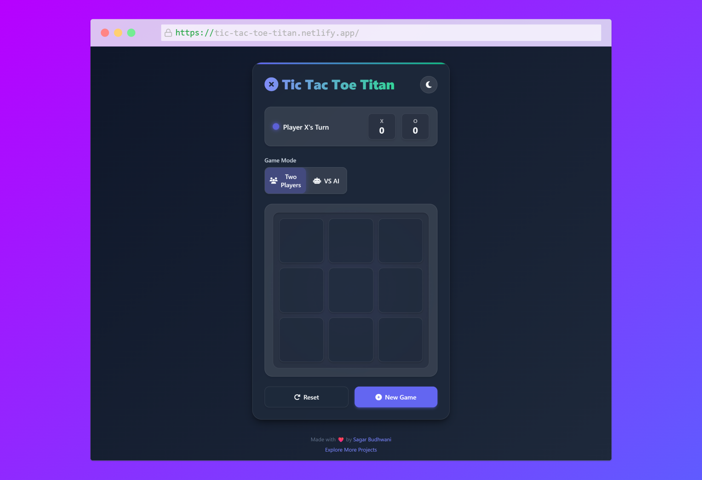

# 🎮 Tic Tac Toe Titan

[](LICENSE)


A modern, feature-rich Tic Tac Toe game with AI opponent, beautiful glassmorphism design, and multiple difficulty levels. Play against a friend or challenge the smart AI with customizable settings.

## 🌐 Live Demo

<div align="center">
  <a href="https://tic-tac-toe-titan.netlify.app/">
    
  </a>
  <br>
  <a href="https://tic-tac-toe-titan.netlify.app/">
    
  </a>
</div>

## 📂 File Structure

```bash
Tic-Tac-Toe-Titan/
├── Screenshots/
│ └── screenshot.png # Game screenshot
├── index.html # Main game interface
├── styles.css # Complete visual styling with glassmorphism
├── script.js # Game logic and AI implementation
├── README.md # This document
└── LICENSE # MIT License
```

## 🚀 Features

**Game Modes:**
- 👥 Two Player Mode (Play with a friend)
- 🤖 VS AI Mode (Challenge the computer)
- 🎯 Multiple AI difficulties (Easy, Medium, Hard)

**Smart AI:**
- 🧠 Minimax algorithm implementation
- ⚡ Three difficulty levels
- 🔄 Configurable first move (Player or AI)

**Visual Design:**
- 🌙 Dark/Light mode toggle
- 🎨 Glassmorphism UI with smooth animations
- 📱 Fully responsive design
- ✨ Smooth hover effects and transitions

**Game Features:**
- 📊 Score tracking
- 🔄 Reset and New Game options
- 🏆 Winning cell highlighting
- 🔊 Visual feedback for all actions

## 🎮 Quick Start

1. **Clone or download the repository**

```bash
git clone https://github.com/Sagarbudhwani/Tic-Tac-Toe-Titan.git
```

2. **Open in browser**
   - Simply open `index.html` in any modern browser
   - No build process or dependencies required

3. **Start playing!**
   - Choose your game mode (Two Players or VS AI)
   - Select AI difficulty and first move preferences
   - Click on cells to make your moves
   - Track scores and switch themes as needed

## 🛠️ For Developers

**Game Architecture:**
- Pure vanilla JavaScript (no frameworks)
- CSS Grid for responsive board layout
- CSS Variables for easy theming
- LocalStorage for theme preference persistence

**AI Implementation:**
The AI uses the Minimax algorithm with alpha-beta pruning:
- **Easy**: Limited search depth (3 levels)
- **Medium**: Moderate search depth (5 levels)  
- **Hard**: Full search depth (9 levels)

**Customization Options:**
- Modify colors in the CSS `:root` variables
- Adjust AI difficulty depths in the JavaScript
- Customize animations and transitions in CSS

**Key Technical Features:**
- Event-driven architecture
- State management for game progress
- Responsive design with mobile-first approach
- Accessibility considerations

## 🎯 How to Play

1. **Two Player Mode**: Take turns with a friend clicking on cells
2. **VS AI Mode**: Play against the computer with your chosen difficulty
3. **Objective**: Get three of your symbols in a row (horizontal, vertical, or diagonal)
4. **First Move**: Configure who starts the game in AI settings

## 📜 License

MIT © Sagar Budhwani - Free to use, modify, and share! See [LICENSE](LICENSE) for details.

## 👨‍💻 Developer

Developed by [Sagar Budhwani](https://github.com/Sagarbudhwani)

Check out more of my projects at [https://appsbysagar.netlify.app](https://appsbysagar.netlify.app)

---

<div align="center">
  
**⭐ Star this repo if you find it useful!**

</div>
